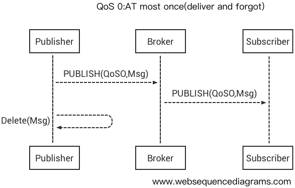
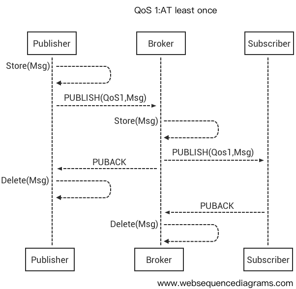
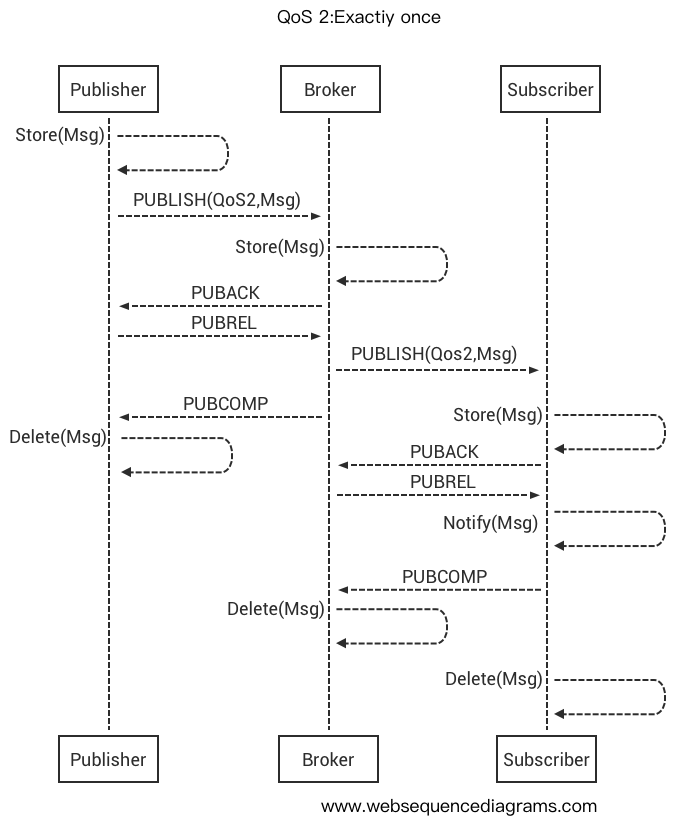

# MQTT Protocol

## MQTT - Light Weight Pub/Sub Messaging Protocol for IoT

### Introduction

MQTT is a light weight client server publish/subscribe messaging transport protocol. It is ideal for use in many situations, including constrained environments such as for communication in Machine to Machine (M2M) and Internet of Things context where a small code footprint is required and/or network bandwidth is at a premium.

MQTT Web site: [ http://mqtt.org ](http://mqtt.org)

MQTT V3.1.1 standard: [ http://docs.oasis-open.org/mqtt/mqtt/v3.1.1/os/mqtt-v3.1.1-os.html ](http://docs.oasis-open.org/mqtt/mqtt/v3.1.1/os/mqtt-v3.1.1-os.html)

### Features

1. Open messaging transport protocol, easy to implement.
2. Use of publish/subscribe message pattern, which supports many-to-many communication.
3. Based on TCP/IP network connection.
4. 1 byte Fixed header, 2bytes KeepAlive packet. Compact packet structure.
5. Support QoS, reliable transmission.

### Applications

MQTT protocol is widely used in Internet of Things, Mobile Internet, smart hardware, automobile, energy and other industry.

1. IoT M2M communication, IoT big data collection
2. Mobile message push, Web message push
3. Mobile instant messenger
4. Smart hardware, smart home, smart phone
5. Automobile communication, electric vehicle charging station/pole
6. Smart city, telemedicine, distance education
7. Energy industry

## MQTT Topic-based Message Routing

MQTT protocol uses topic to route message. Topic is a hierarchical structured string, like:

    chat/room/1

    sensor/10/temperature

    sensor/+/temperature

    $SYS/broker/metrics/packets/received

    $SYS/broker/metrics/#

A forward slash (/) is used to separate levels within a topic tree and provide a hierarchical structure to the topic space. The number sigh (#) is a wildcard for multi-level in a topic and the plus sign (+) is a wildcard for single-level:

    '+': a/+ matches a/x, a/y

    '#': a/# matches a/x, a/b/c/d

Publisher and subscriber communicate using topic routing mechanism. E.g., mosquitto CLI message pub/sub:

    mosquitto_sub -t a/b/+ -q 1

    mosquitto_pub -t a/b/c -m hello -q 1

::: tip Tip
Wildcards are only allowed when subscribing, they are not allowed when publishing.
:::

## MQTT V3.1.1 Protocol Packet

### MQTT Packet Format

### Fixed Header

    +----------+-----+-----+-----+-----+-----+-----+-----+-----+
    | Bit      |  7  |  6  |  5  |  4  |  3  |  2  |  1  |  0  |
    +----------+-----+-----+-----+-----+-----+-----+-----+-----+
    | byte1    |   MQTT Packet type    |         Flags         |
    +----------+-----------------------+-----------------------+
    | byte2... |   Remaining Length                            |
    +----------+-----------------------------------------------+

### Packet Type

| Type Name   | Value | Description                                |
| ----------- | ----- | ------------------------------------------ |
| CONNECT     | 1     | Client request to connect to Server        |
| CONNACK     | 2     | Connect acknowledgement                    |
| PUBLISH     | 3     | Publish message                            |
| PUBACK      | 4     | Publish acknowledgement                    |
| PUBREC      | 5     | Publish received (assured delivery part 1) |
| PUBREL      | 6     | Publish release (assured delivery part 2)  |
| PUBCOMP     | 7     | Publish complete (assured delivery part 3) |
| SUBSCRIBE   | 8     | Client subscribe request                   |
| SUBACK      | 9     | Subscribe acknowledgement                  |
| UNSUBSCRIBE | 10    | Unsubscribe request                        |
| UNSUBACK    | 11    | Unsubscribe acknowledgement                |
| PINGREQ     | 12    | PING request                               |
| PINGRESP    | 13    | PING response                              |
| DISCONNECT  | 14    | Client is disconnecting                    |

### PUBLISH

A PUBLISH Control Packet is sent from a client to a server or from a server to a client to transport an application message. PUBACK is used to acknowledge a QoS1 packet and PUBREC/PUBREL/PUBCOMP are used to accomplish a QoS2 message delivery.

### PINGREQ/PINGRESP

PINGREQ can be sent from a client to server in a KeepAlive interval in absence of any other control packets. The server responses with a PINGRESP packet. PINGREQ and PINGRESP each have a length of 2 bytes.

## MQTT Message QoS

MQTT Message QoS is not end to end, but between the client and the server. The QoS level of a message being received, depends on both the message QoS and the topic QoS.

| Published QoS | Topic QoS | Received QoS |
| ------------- | --------- | ------------ |
| 0             | 0         | 0            |
| 0             | 1         | 0            |
| 0             | 2         | 0            |
| 1             | 0         | 0            |
| 1             | 1         | 1            |
| 1             | 2         | 1            |
| 2             | 0         | 0            |
| 2             | 1         | 1            |
| 2             | 2         | 2            |

### Qos0 Message Publish & Subscribe

### Qos1 Message Publish & Subscribe

### Qos2 Message Publish & Subscribe

## MQTT Session (Clean Session Flag)

When a MQTT client sends CONNECT request to a server, it can use 'Clean Session' flag to set the session state.

'Clean Session' is 0 indicating a persistent session. When a client is disconnected the session retains and offline messages are also retained, until the session times out.

'Clean Session' is 1 indicating a transient session. If a client is disconnected, the session is destroyed.

## MQTT CONNECT Keep Alive

When MQTT client sends CONNECT packet to server, it uses KEEP Alive bytes to indicate the KeepAlive interval.

In the absence of sending any other control packet, the client must send a PINGREQ packet in ther KeepAlive interval and the server responses with a PINGRESP packet.

If the server doesn't receive any packet from a client within 1.5 \* KeepAlive time interval, it close the connection to the client.

::: tip Tip
By default EMQ X uses 2.5 \* KeepAlive interval.
:::

## MQTT Last Will

A client can declare a Will Message with a Topic and Payload, inside its MQTT CONNECT message sending to the server.

If the MQTT client goes offline abnormally (without sending a DISCONNECT), the server published the Will Message of this client.

## MQTT Retained Message

When a MQTT client sends PUBLISH, it can set the RETAIN flag to indicate a retained message. A retained message is stored by broker and will be sent to clients who subscribe this topic later. A topic has only one retained message which implies new retained message will take place of the old one.

E.g.: A mosquitto client sent a retained message to topic 'a/b/c':

    mosquitto_pub -r -q 1 -t a/b/c -m 'hello'

Later, a client sbuscribes to topic 'a/b/c', and it will receive:

    $ mosquitto_sub -t a/b/c -q 1
    hello

Two ways to clean a retained message:

1. Client sends an empty message using the same topic of the retained message.:

       mosquitto_pub -r -q 1 -t a/b/c -m ''

2. The server set a timeout interval for retained message.

## MQTT WebSocket Connection

Besides TCP, MQTT Protocol supports WebSocket as transport layer. A client can connect to server and publish/subscribe through a WebSocket browser.

When using MQTT WebSocket protocol, binary mode must be used and header of sub-protocol must be carried:

    Sec-WebSocket-Protocol: mqttv3.1 (or mqttv3.1.)1

## MQTT Client Library

### emqtt Client Library

emqtt project: [ https://github.com/emqtt ](https://github.com/emqtt)

| [ emqttc ](https://github.com/emqtt/emqttc)       | Erlang MQTT Client Library       |
| ------------------------------------------------- | -------------------------------- |
| [ CocoaMQTT ](https://github.com/emqtt/CocoaMQTT) | Swift MQTT Client Library        |
| [ QMQTT ](https://github.com/emqtt/qmqtt)         | QT Framework MQTT Client Library |

### Eclipse Paho Client Library

Paho's Website: [ http://www.eclipse.org/paho/ ](http://www.eclipse.org/paho/)

### mqtt.org Client Library

mqtt.org: [ https://github.com/mqtt/mqtt.github.io/wiki/libraries ](https://github.com/mqtt/mqtt.github.io/wiki/libraries)

## MQTT v.s. XMPP

MQTT is designed to be light weight and easy to use. It is suitable for the mobile Internet and the Internet of Things. While XMPP is a product of the PC era.

1. MQTT uses a one-byte fixed header and two-byte KeepAlive packet, its packet has a size and simple to en/decode. While XMPP is encapsulated in XML, it is large in size and complicated in interaction.
2. MQTT uses topic for routing, it is more flexible than XMPP's peer to peer routing based on JID.
3. MQTT protocol doesn't define a payload format, thus it carries different higher level protocol with ease. While the XMPP uses XML for payload, it must encapsulate binary in Base64 format.
4. MQTT supports message acknowledgement and QoS mechanism, which is absent in XMPP, thus MQTT is more reliable.
