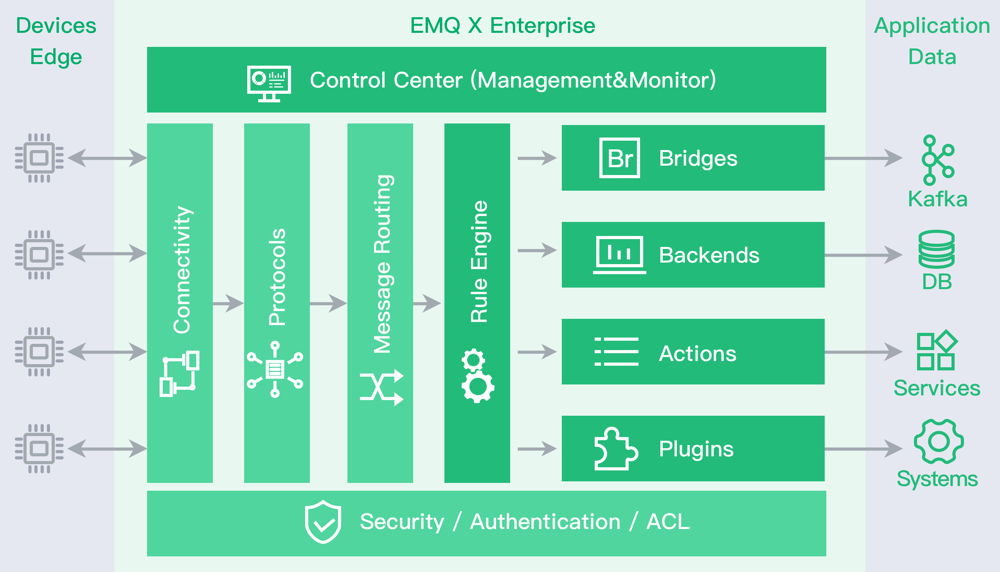
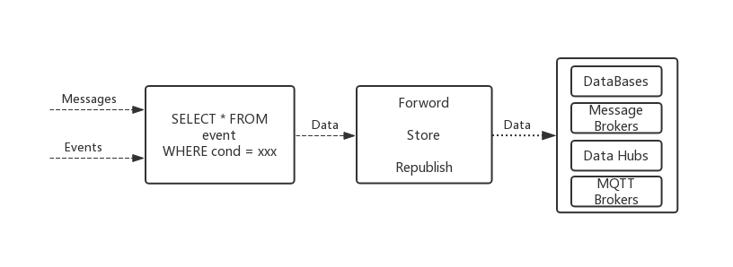

# Overview

EMQ is a distributed, massively scalable, highly extensible MQTT message broker which can sustain million level connections. When the document is being writen, EMQ hits 200,000 downloads on Github, it is chosen by more than 3000 users worldwide. More than 10,000 nodes were already deployed and serve 30 million mobile and IoT connections.

EMQ X is the enterprise edition of the EMQ broker which extends the function and enhance the performance of EMQ. It improves the system architecture of EMQ, adopts Scalable RPC mechanism, provides more reliable clustering and higher performance of message routing.

EMQ X supports persistence MQTT messages to Redis, MySQL, PostgreSQL, MongoDB, Cassandra and other databases. It also supports bridging and forwarding MQTT messages to enterprise messaging middleware like Kafka and RabbitMQ.

EMQ X can be used as a scalable, reliable, enterprise-grade access platform for IoT, M2M, smart hardware, smart home and mobile messaging applications that serve millions of device terminals.

## Design Objective

EMQ (Erlang MQTT Broker) is an open source MQTT broker written in Erlang/OTP. Erlang/OTP is a concurrent, fault-tolerant, soft-realtime and distributed programming platform. MQTT is an extremely lightweight publish/subscribe messaging protocol powering IoT, M2M and Mobile applications.

The design objectives of EMQ X focus on enterprise-level requirements, such as high reliability, massive connections and extremely low latency of message delivery:

1. Steadily sustains massive MQTT client connections. A single node is able to handles about 1 million connections.
2. Distributed clustering, low-latency message routing. Single cluster handles 10 million level subscriptions.
3. Extensible broker design. Allow customizing various Auth/ACL extensions and data persistence extensions.
4. Supports comprehensive IoT protocols: MQTT, MQTT-SN, CoAP, WebSocket and other proprietary protocols.

## Features

1. Scalable RPC Architecture: segregated cluster management channel and data channel between nodes.
2. Persistence to Redis: subscriptions, client connection status, MQTT messages, retained messages, SUB/UNSUB events.
3. Persistence to MySQL: subscriptions, client connection status, MQTT messages, retained messages.
4. Persistence to PostgreSQL: subscriptions, client connection status, MQTT messages, retained messages.
5. Persistence to MongoDB: subscriptions, client connection status, MQTT messages, retained messages.
6. Persistence to Cassandra: subscriptions, client connection status, MQTT messages, retained messages.
7. Persistence to DynamoDB: subscriptions, client connection status, MQTT messages, retained messages.
8. Persistence to InfluxDB: MQTT messages.
9. Persistence to OpenTDSB: MQTT messages.
10. Persistence to TimescaleDB: MQTT messages.
11. Bridge to Kafka: EMQ X forwards MQTT messages, client connected/disconnected event to Kafka.
12. Bridge to RabbitMQ: EMQ X forwards MQTT messages, client connected/disconnected event to RabbitMQ.
13. Bridge to Pulsar: EMQ X forwards MQTT messages, client connected/disconnected event to Pulsar.
14. Rule Engine：Convert EMQ X events and messages to a specified format, then save them to a database table, or send them to a message queue.

## Scalable RPC Architecture

EMQ X improves the communication mechanism between distributed nodes, segregates the cluster management channel and the data channel, and greatly improved the message throughput and the cluster reliability.

::: tip Tip
the dash line indicates the cluster management and the solid line indicates the data exchange.
:::

Scalable RPC configuration:

    ## TCP server port.
    rpc.tcp_server_port = 5369

    ## Default TCP port for outgoing connections
    rpc.tcp_client_port = 5369

    ## Client connect timeout
    rpc.connect_timeout = 5000

    ## Client and Server send timeout
    rpc.send_timeout = 5000

    ## Authentication timeout
    rpc.authentication_timeout = 5000

    ## Default receive timeout for call() functions
    rpc.call_receive_timeout = 15000

    ## Socket keepalive configuration
    rpc.socket_keepalive_idle = 7200

    ## Seconds between probes
    rpc.socket_keepalive_interval = 75

    ## Probes lost to close the connection
    rpc.socket_keepalive_count = 9

::: tip Tip
If firewalls are deployed between nodes, the 5369 port on each node must be opened.
:::

## Subscription by Broker

EMQ X supports subscription by broker. A client doesn't need to expressly subscribe to some particular topics. The EMQ X broker will subscribe to this specified topics on behalf of the client. The topics are loaded from Redis or databases.

EMQ X subscription by broker is suitable for devices requiring low power consumption and narrow network bandwidth. This feature brings convenience to massive device management too.

## MQTT Data Persistence

EMQ X supports MQTT data (subscription, messages, client online/offline status) persistence to Redis, MySQL, PostgreSQL, MongoDB and Cassandra databases:

For details please refer to the "Backends" chapter.

## Message Bridge & Forward

EMQ X allows bridging and forwarding MQTT messages to message-oriented middleware such as RabbitMQ and Kafka. It can be deployed as an IoT Hub:

## Rule Engine

The EMQ X rules engine has the flexibility to handle messages and events.

1. Message Republish.
2. Bridges data to Kafka, Pulsar, RabbitMQ, MQTT Broker.
3. Persistence data to MySQL, PostgreSQL, Redis, MongoDB, DynamoDB, Cassandra, InfluxDB, OpenTSDB, TimescaleDB.
4. Sends data to WebServer.

For details please refer to the "Rule Engine" chapter.
